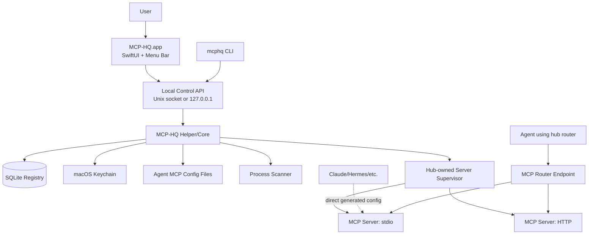

# MCP-HQ Architecture

Last updated: 2026-05-28

## 1. System overview

MCP-HQ is composed of three layers:

1. Native macOS UI app
2. Local helper/core service
3. Optional MCP router/proxy

The control plane manages discovery, configs, secrets, lifecycle, status, and diagnostics.

The data plane, when enabled, remains MCP-native.

## 2. Control plane vs data plane

### Control plane

Used for app management operations.

Examples:

- scan configs
- list servers
- run doctor checks
- preview generated config
- write config after approval
- start/stop hub-owned server
- view logs
- manage profiles
- manage secrets

Transport:

- Unix domain socket preferred for local-only security
- localhost HTTP acceptable for early development

### Data plane

Used for actual MCP tool/resource/prompt calls.

Rule:

- If MCP-HQ proxies traffic, it must expose a real MCP endpoint.
- Do not invent a reduced REST replacement for MCP tool calls.

## 3. Component responsibilities

### 3.1 MCP-HQ.app

The app is the user-facing control surface.

Responsibilities:

- onboarding
- dashboard
- menu bar indicator
- server detail screens
- doctor reports
- config diff approval
- secrets UI
- profile management
- notifications

It should not directly own long-running MCP server subprocesses.

### 3.2 MCP-HQ Helper/Core

The helper performs system and protocol work.

Responsibilities:

- scan known config files
- parse JSON/YAML/TOML/plist configs
- scan process table
- check command availability under realistic GUI PATH
- perform safe MCP initialization/listing checks
- supervise hub-owned servers
- collect logs
- read/write SQLite
- expose local control API
- generate configs
- backup and rollback configs

### 3.3 MCP router/proxy

Optional later component.

Responsibilities:

- expose a single MCP endpoint
- connect to multiple downstream MCP servers
- namespace tool names
- map upstream sessions to downstream sessions
- enforce policies
- log usage
- forward MCP semantics faithfully

Non-MVP.

## 4. Server ownership model

### Agent-owned server

A server launched by Claude, Hermes, Gemini, etc.

MCP-HQ can:

- discover it
- parse its config
- diagnose it
- generate replacement config
- observe process state

MCP-HQ should not stop or restart it by default.

### Hub-owned server

A server launched by MCP-HQ Helper.

MCP-HQ can:

- start
- stop
- restart
- auto-start
- tail logs
- health check
- expose directly or through router

## 5. Data model

### ServerDefinition

Canonical definition of an MCP server.

Fields:

- `id`
- `display_name`
- `transport`: `stdio`, `http`, `sse`, `streamable_http`
- `command`
- `args`
- `url`
- `headers`
- `env_bindings`
- `working_directory`
- `roots`
- `install_source`
- `tags`
- `created_at`
- `updated_at`

### ConfigSource

Where a server definition came from.

Fields:

- `id`
- `agent_id`
- `path`
- `format`
- `last_seen_at`
- `last_hash`
- `writable`

### Agent

An MCP client app/tool.

Fields:

- `id`: `claude`, `gemini`, `hermes`, etc.
- `display_name`
- `config_paths`
- `config_format`
- `launch_context_notes`

### AgentBinding

Which server is enabled for which agent.

Fields:

- `agent_id`
- `server_id`
- `enabled`
- `profile_id`
- `generated_config_state`
- `last_synced_at`

### SecretBinding

Mapping from env/header field to Keychain secret.

Fields:

- `server_id`
- `name`
- `destination`: `env` or `header`
- `destination_key`
- `keychain_service`
- `keychain_account`
- `required`

### RuntimeInstance

Observed or supervised running process.

Fields:

- `id`
- `server_id`
- `pid`
- `owner`: `agent`, `hub`, `unknown`
- `command_line`
- `started_at`
- `cpu_percent`
- `memory_bytes`
- `status`
- `last_error`

### DoctorFinding

Diagnostic output.

Fields:

- `id`
- `severity`: `info`, `warning`, `error`
- `server_id`
- `agent_id`
- `code`
- `message`
- `suggested_fix`
- `autofix_available`

## 6. Local API sketch

Base endpoint:

- Unix socket: `~/Library/Application Support/MCP-HQ/mcphq.sock`
- Dev HTTP fallback: `http://127.0.0.1:37373`

Endpoints:

- `GET /api/v1/status`
- `POST /api/v1/scan`
- `GET /api/v1/servers`
- `GET /api/v1/servers/{id}`
- `GET /api/v1/servers/{id}/tools`
- `POST /api/v1/servers/{id}/start`
- `POST /api/v1/servers/{id}/stop`
- `POST /api/v1/doctor/run`
- `GET /api/v1/doctor/findings`
- `GET /api/v1/agents`
- `GET /api/v1/agents/{id}/config-preview`
- `POST /api/v1/agents/{id}/write-config`
- `POST /api/v1/rollback/{backup_id}`
- `GET /api/v1/logs/{runtime_instance_id}`

## 7. MCP router design principles

When added, the router should behave as an MCP server.

Tool naming:

- default: `<server_id>__<tool_name>`
- example: `github__list_issues`
- example: `qmd__query`

Session isolation:

- one upstream client session should map to its own downstream session set by default
- shared pooling should be opt-in only for servers marked stateless

Feature handling:

- supported features are forwarded
- unsupported features fail explicitly with useful MCP errors
- no silent degradation

Policy:

- allow/deny by agent, profile, server, tool, resource pattern, and write capability
- optional approval prompts for dangerous tools

## 8. Security model

Initial scope:

- local-only app
- no cloud account
- no remote API by default
- no plaintext secrets in MCP-HQ storage
- backups may contain generated configs and must be protected accordingly

Local API security:

- bind to Unix socket when possible
- if HTTP is used, bind only to `127.0.0.1`
- require a local auth token stored in Keychain for non-UI clients

Config writes:

- preview required
- backup required
- rollback required
- preserve unknown fields

Secrets:

- Keychain by default
- reveal/copy requires explicit user action
- generated plaintext env vars only when target app requires them and user approves

## 9. Error handling philosophy

Every failure should answer:

1. What broke?
2. Where did it come from?
3. What can the user do?
4. Can MCP-HQ fix it safely?
5. What changed, if anything?

Examples:

- `command_not_found`: `uvx` is not available to Claude Desktop's GUI environment.
- `missing_secret`: `GITHUB_PERSONAL_ACCESS_TOKEN` is required but not mapped.
- `mcp_initialize_failed`: server launched but did not complete MCP initialize.
- `duplicate_tool_name`: two enabled servers expose `search` without namespacing.

## 10. Implementation posture

Build in this order:

1. read-only scan
2. parse and persist registry
3. doctor checks
4. config preview
5. backup/rollback writes
6. Keychain secrets
7. hub-owned lifecycle
8. optional MCP router
