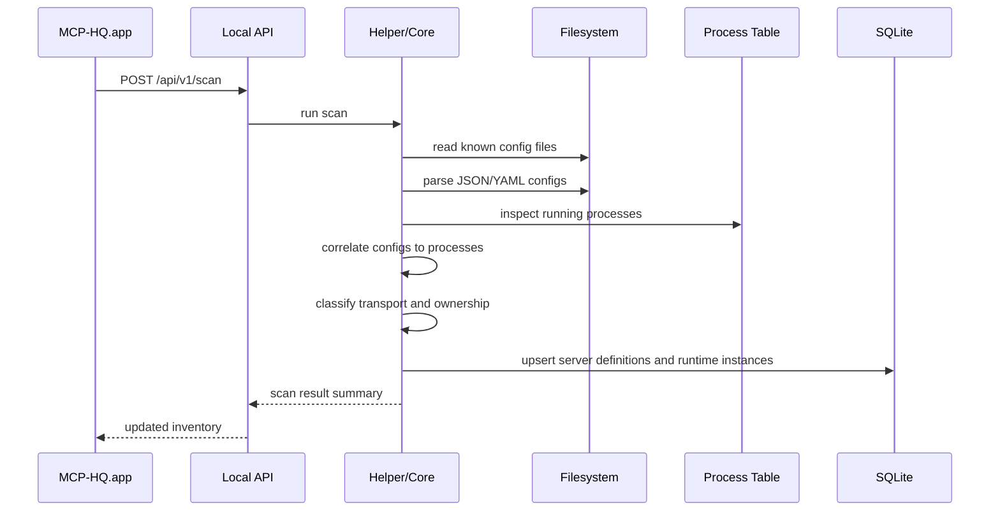
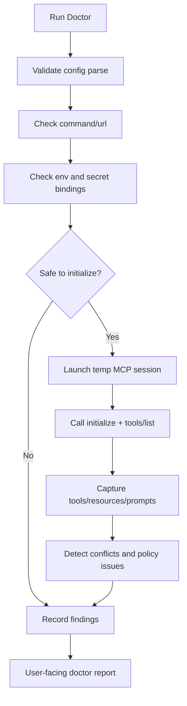
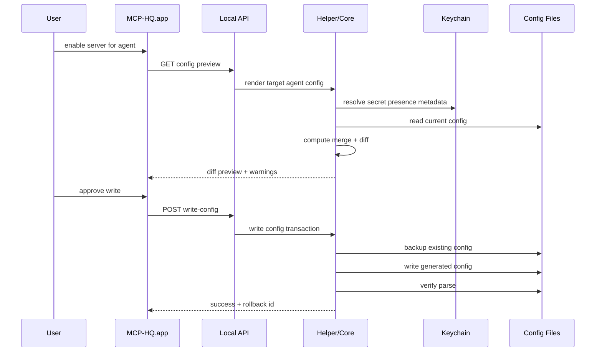
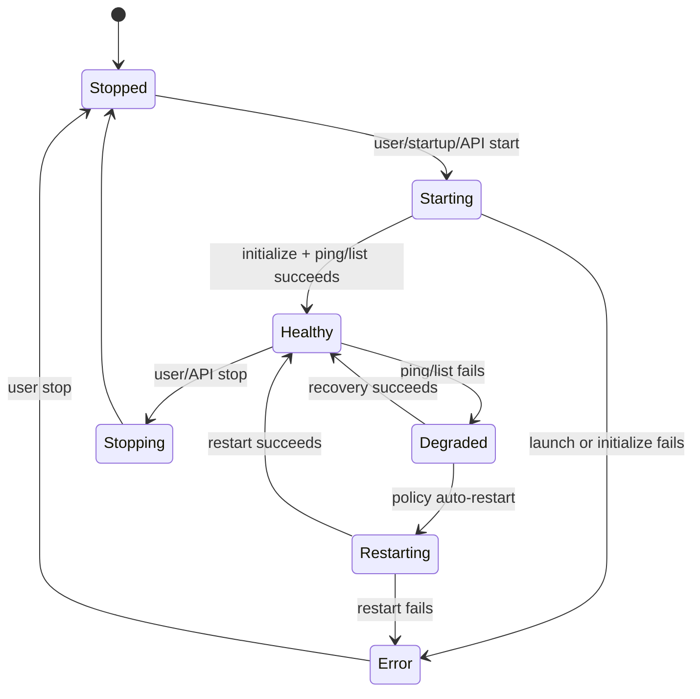
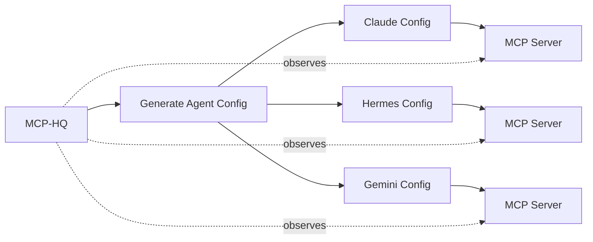
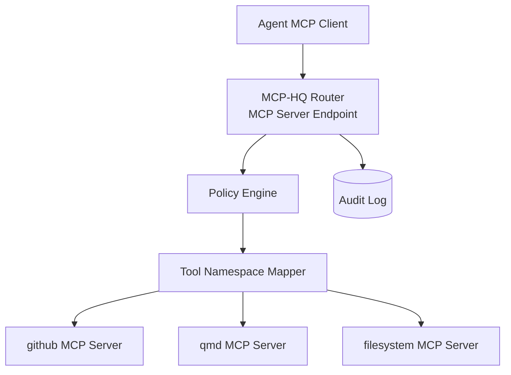
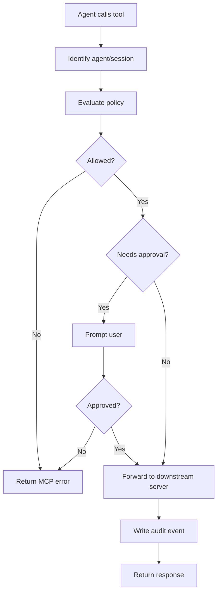

# MCP-HQ Infrastructure Flow

Last updated: 2026-05-28

## 1. Discovery flow



Inputs:

- known agent config paths
- process table
- known command/runtime patterns
- optional catalog metadata

Outputs:

- canonical server definitions
- config source records
- runtime instances
- initial doctor findings

## 2. Doctor flow



Safe initialize rules:

- do not run unknown destructive commands
- prefer servers already configured by user
- use short timeout
- use sanitized environment
- avoid calling actual tools during doctor MVP

## 3. Config generation flow



Hard requirements:

- backup before write
- parse verification after write
- rollback id returned
- preserve unknown config where possible
- never silently drop user-managed entries

## 4. Hub-owned server lifecycle flow



For each hub-owned server, collect:

- stdout/stderr logs
- launch timestamp
- exit code
- restart count
- last health check
- CPU/memory

## 5. Direct-agent mode

This is the recommended early mode.



Benefits:

- no MCP functionality loss
- agents retain native behavior
- app still provides visibility and config sanity

Tradeoff:

- no runtime policy enforcement unless configs are regenerated

## 6. MCP router mode

Later optional mode.



The router exposes merged capabilities:

- `github__list_issues`
- `github__create_pull_request`
- `qmd__query`
- `filesystem__read_file`

It must preserve:

- request ids
- cancellation
- progress notifications
- error semantics
- resources/prompts
- roots where applicable
- sampling behavior or explicit unsupported errors

## 7. Permissions flow



Policy dimensions:

- agent
- profile
- server
- tool
- resource URI
- filesystem root
- read/write classification
- destructive operation flag

## 8. Local development infrastructure

Suggested repo structure:

```text
MCP-HQ/
  README.md
  docs/
    PRD.md
    TECH_STACK.md
    ARCHITECTURE.md
    INFRASTRUCTURE_FLOW.md
    ROADMAP.md
    OPEN_QUESTIONS.md
  app/
    MCPHQApp/              # future SwiftUI app
  core/
    MCPHQCore/             # future helper/core package
  fixtures/
    configs/
      claude/
      gemini/
      hermes/
    mcp-servers/
  tests/
    config-parser-tests/
    doctor-tests/
    golden-generated-configs/
```

## 9. Observability

Local logs:

- helper log
- scan log
- per-server stdout/stderr logs
- config write audit log
- doctor run history

User-visible events:

- server became unhealthy
- config write succeeded/failed
- secret missing
- restart loop detected
- generated config drifted from registry

## 10. Failure recovery

Every mutating operation should be transactional where possible.

Config write transaction:

1. read current file
2. compute hash
3. write backup with timestamp and hash
4. write candidate file
5. parse candidate
6. if parse fails, restore backup
7. record audit event

Server launch recovery:

1. capture command/env snapshot with secrets redacted
2. stream logs
3. initialize with timeout
4. mark healthy or error
5. avoid infinite restart loops
